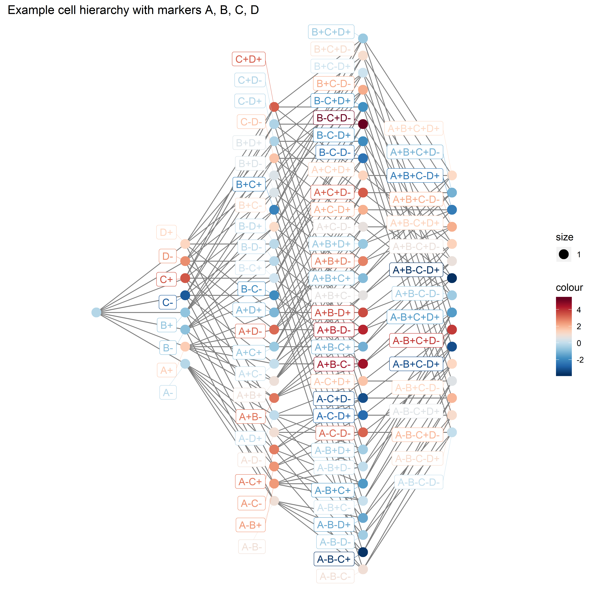

# ggplot_igraph

[gr.R](gr.R) is an R script that includes the functions needed to plot graphs using the ggplot2 package with self-specified or igraph-specified layouts. These are scratch scripts I used to create the plots in:

Yue, Alice, et al. "Identifying differential cell populations in flow cytometry data accounting for marker frequency." BioRxiv (2019): 837765.

And are uploaded for convenient use.

[example.R](example.R) contains an example of how to use these functions using a toy lattice graph [gr.Rdata](gr.Rdata).

First, install the required R packages.
```r
libr = function(pkgs) {
  if (length(setdiff(pkgs, rownames(installed.packages()))) > 0) 
    install.packages(setdiff(pkgs, rownames(installed.packages())), verbose=F)
  sapply(pkgs, require, character.only=T)
}
libr(c("purrr", "igraph", "RColorBrewer", "ggplot2", "ggrepel", "plotly"))
```

Then load the functions and create your graph data.
```r
# load example graph; v contains nodes named by "phenotype" & e contains edges.
load("gr.Rdata")

# source the functions
source("gr.R")
```

Give your graph a layout (give the parameter `layout_fun` a layout function from the igraph package; the default layout or `NULL` is to use an evenly spaced hierarchy layout).
```r
gr <- set_layout_graph(gr, layout_fun=NULL) # set x y coordinates (layout)
```

Add plotting parameters to your data grams e.g. colour, label, which nodes/edges to show/hide (`T`/`F`) etc.
```r
gr <- ggdf(gr) # add plotting parameters to data frames, editted below
gr$v$colour <- rnorm(nrow(gr$v),0,2) # random node colours
gr$v$label <- gr$v$phenotype # give some node labels
gr$v$v_ind <- gr$v$label_ind <- TRUE # which nodes to colour in and label
gr$e$e_ind <- !grepl("[-]",gr$e$from) & !grepl("[-]",gr$e$to) # which edges to show
```

And finally, save the plot.
```r
# create and save ggplot
gch <- gggraph(gr, main="Example cell hierarchy with markers A, B, C, D")
ggplot2::ggsave("gr.png",
                plot=gch, scale=1, width=9, height=9,
                units="in", dpi=500, limitsize=TRUE)
```


